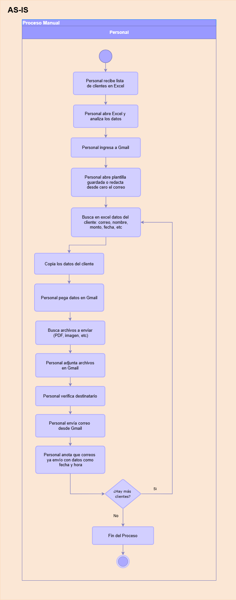
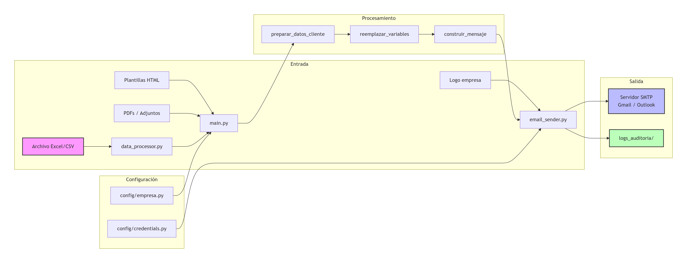
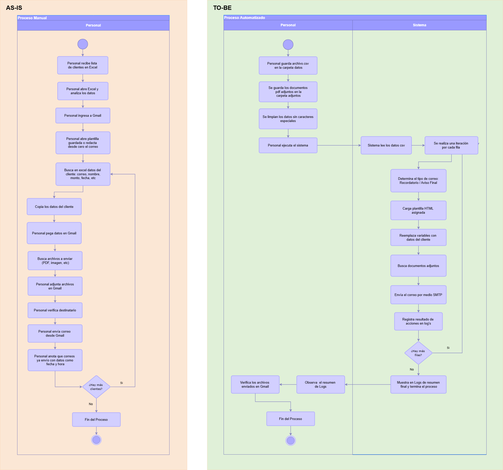

# Automatizacion-de-Envio-de-Correos-desde-Excel-con-Python

## Descripción General
Este proyecto consiste en un script desarrollado en Python que automatiza el proceso de envío masivo de correos electrónicos personalizados a partir de datos contenidos en archivos CSV exportados desde Excel. La herramienta permite leer registros, personalizar plantillas HTML con información específica de cada destinatario, adjuntar documentos (PDF, imágenes, etc.) y enviar los correos de forma automatizada, generando además un registro de auditoría detallado de cada acción.
** Las 4 tareas principales del sistema: **
- Leer y procesar datos desde archivo CSV (exportado de Excel)
- Seleccionar y personalizar la plantilla HTML según el tipo de comunicación
- Adjuntar documentos específicos para cada destinatario
- Enviar correos y registrar cada acción en logs para auditoría

** Capacidad del sistema: **
- Cuentas personales (Gmail, Hotmail): hasta 500 envíos diarios
- Cuentas corporativas: hasta 2000 envíos diarios

## Problemática
En la mayoría de empresas, la información operativa se gestiona en Excel. Ventas tiene un Excel con clientes, RH tiene un Excel con empleados, Logística tiene un Excel con proveedores. Cuando necesitan enviar comunicaciones masivas (cobranzas, boletas, notificaciones, promociones), el proceso es siempre el mismo y es manual:
Una persona del área abre el Excel, filtra el primer registro, copia los datos, abre su correo, redacta un mensaje, busca el archivo adjunto en las carpetas del servidor, lo adjunta, envía, y marca en el Excel que ya realizó el envío. Luego repite para el siguiente registro.

** El problema concreto: **
- Tomar 5-10 minutos por registro significa que para 100 registros se pierde casi un día completo de trabajo
- Los errores son frecuentes: adjuntar archivo equivocado, copiar mal un nombre, omitir destinatarios
- No hay trazabilidad: si en el futuro preguntan por un envío específico, no hay forma de verificarlo directamente
- El proceso depende del personal del área: si se enferma o renuncia, se detiene generando retrasos

#Proceso actual (AS-IS)

**Problemas identificados:**
- Proceso manual y repetitivo que consume horas de trabajo
- Alto riesgo de error humano en cada paso
- Sin registro centralizado ni trazabilidad
- Difícil de escalar cuando el volumen crece

